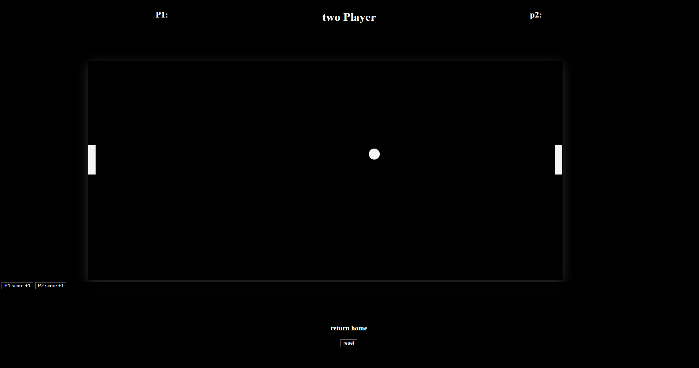

<h1>Pong</h1>

<a href="https://pong-perscholas-project.netlify.app/">Play the game</a>
<h1>Motivation</h1>

 I have see this game I was thinking this or brick brakier pong brings me back to early games on the phone like on black berry early iphone and android phone.This game was fun to make and a lot more challenging that I though.<a href="https://americanhistory.si.edu/blog/2012/04/pong-atari-and-the-origins-of-the-home-video-game.html#:~:text=He%20hired%20Al%20Alcorn%20and,small%20bar%20in%20Sunnyvale%2C%20California."> learn more about pong</a>.

<h1>Build status</h1>

<!-- TODO ask what is build status and what is code style -->
<h1> Code style</h1>

<h1> Screen shots</h1>

<h1>Tech/framework used</h1>
<h3> Html ,CSS, Javascript, using VScode</h3>

<h1>Resources/Credits</h1>
<ul>
    <li>https://developer.mozilla.org/en-US/docs/Web/CSS/CSS_grid_layout/Relationship_of_grid_layout_with_other_layout_methods</li> 
    <li>https://www.w3docs.com/snippets/css/how-to-center-the-content-in-grid.html#:~:text=Solution%20with%20the%20CSS%20text,it%20to%20the%20grid%20container.</li> 
    <li>https://developer.mozilla.org/en-US/docs/Web/JavaScript/Guide/Modules</li> 
    <li>https://getcssscan.com/css-box-shadow-examples</li> 
    <li>https://developer.mozilla.org/en-US/docs/Web/CSS/CSS_grid_layout/Relationship_of_grid_layout_with_other_layout_methods</li> 
    <li>https://www.w3docs.com/snippets/css/how-to-center-the-content-in-grid.html#:~:text=Solution%20with%20the%20CSS%20text,it%20to%20the%20grid%20container</li> 
    <li>https://developer.mozilla.org/en-US/docs/Web/JavaScript/Guide/Modules</li> 
    <li>https://developer.mozilla.org/en-US/docs/Web/API/Window/load_event</li> 
    <li>https://www.google.com/search?q=how%20to%20move%20something%20using%20kebord%20js&oq=how%20to%20move%20something%20using%20kebord%20js&gs_lcrp=EgZjaHJvbWUyBggAEEUYOTIJCAEQIRgKGKABMgkIAhAhGAoYoAEyCQgDECEYChigATIJCAQQIRgKGKAB0gEJMTg1NTNqMGo3qAIAsAIA&sourceid=chrome&ie=UTF-8&authuser=0#fpstate=ive&vld=cid:fd1cc90b,vid:NiG2TnZiFL0</li> 
    <li>https://developer.mozilla.org/en-US/docs/Web/API/Element/getBoundingClientRect</li> 
    <li>https://www.youtube.com/watch?v=bv7nyWcgJLc</li> 
    <li>https://stackoverflow.com/questions/8273047/javascript-function-similar-to-python-range</li> 

</ul>

<h1>*Updates soon to come*</h1>

    <ul>
        <li>Better ball physics</li>
        <li>Player one mode</li>
        <li>Auto scoring</li>
        <li>Sound effects/music</li>
        <li>different game modes</li>
        <li>different themes</li>
        <li>arcade mode and more....</li>
    </ul>

